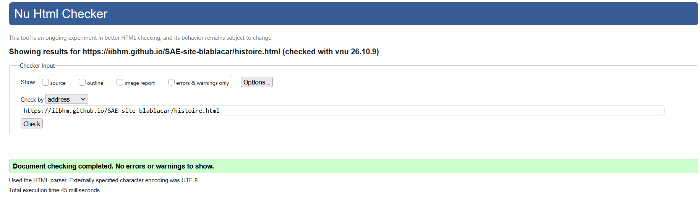
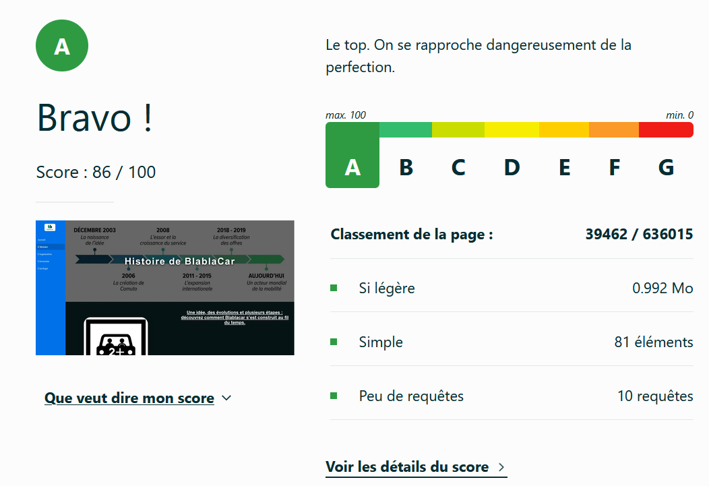

# SAE 05-06 — Site web BlaBlaCar
 
Groupe TP S1C2 — Groupe numéro 17
 
## Sujet
 
[SAE-site-Blablacar](https://iibhm.github.io/SAE-site-blablacar/)
 
Site web de présentation de l'entreprise française de covoiturage BlaBlaCar.
 
## Membres du groupe
 
Quentin TOURNIER (référent du groupe) : [Quentin TOURNIER](mailto:qtournie@edu.univ-fcomte.fr?subject=SAE_1_05_06)  
Sevan VOVILIER : [Sevan VOVILIER](mailto:svovilie@edu.univ-fcomte.fr?subject=SAE_1_05_06)  
Basile DISPOT : [Basile DISPOT](mailto:LOGIN@edu.univ-fcomte.fr?subject=SAE_1_05_06)  
Ibrahim SAOULI : [Ibrahim SAOULI](mailto:isaouli@edu.univ-fcomte.fr?subject=SAE_1_05_06)  
Nathanael RIEGERT-BUISARD : [Nathanael RIEGERT-BUISARD](mailto:nriegert@edu.univ-fcomte.fr?subject=SAE_1_05_06)

## Présentation du projet
Notre projet consiste à créer un site web pour présenter la société française de covoiturage Blablacar. Ce projet sera organisé en 4 pages :
- Une page retrace l'histoire de Blablacar, de la transformation d'un concept de covoiturage à une société que l'on connaît actuellement.
- Une page présente l’organisation de BlaBlaCar en commençant par son identité et ses dirigeants, puis en décrivant ses pôles d’activité et son implantation géographique et humaine, pour finir sur son mode de travail hybride et collaboratif.
- Une page présentera les bienfaits écologiques contenant les bilans carbone des années précédentes et les stratégies de décarbonisation. D'autres bénéfices y seront exposés.
- Une page présentera le chiffre d'affaires de BlaBlaCar ainsi que les stratégies que l'entreprise utilise pour faire augmenter ses bénéfices.

## Entrevue Projet
### Arborescence

```text
SAE-site-blablacar/
├── README.md
├── index.html
├── histoire.html
├── organisation.html
├── economie.html
├── ecologie.html
├── style_blablacar.css
├──Images/
    ├── logo.png
    ├── frise1.jpeg
    ├── covoit.jpeg
    ├── graphique.jpg
    ├── carte_bbc.png
    ├── instagram.png
    ├── x.png
    ├── CO2.jpg
    ├── Graphique CA.png
    ├── ecologie.jpg
    ├── favico.ico
    ├── histoire.jpg
    ├── image_accueil.jpg
    ├── image_centrale_economie.jpg
    ├── organsisation.png
    ├── economie.jpg
    └── web.png
└── doc/
    ├──histoire_eco_concept_sevan.png
    ├──histoire_validator_w3_sevan.png
```
## Développement Site Web et Validation des pages

### Page d'accueil

**Auteur : TOURNIER Quentin**  

Vérification W3C : [Détail ICI](https://validator.w3.org/nu/?showsource=yes&showoutline=yes&showimagereport=yes&doc=https%3A%2F%2Fdemo-am90.github.io%2Fs1-demo%2Findex.html)


ou 


<!--  style="width=400px" ne fonctionne pas -->

### Présentation générale

### Page Histoire

**Auteur : VOVILIER Sevan**  

Vérification W3C : [Détail ICI](https://validator.w3.org/nu/?doc=https%3A%2F%2Fiibhm.github.io%2FSAE-site-blablacar%2Fhistoire.html)

<br>


<br>


### Page Écologie

**Auteur : DISPOT Basile**  

Vérification W3C : [Détail ICI](https://validator.w3.org/nu/?showsource=yes&showoutline=yes&showimagereport=yes&doc=https%3A%2F%2Fdemo-am90.github.io%2Fs1-demo%2Findex.html)


ou 


ou 


### Page Organisation

**Auteur : SAOULI Ibrahim**  

Vérification W3C : [Détail ICI](https://validator.w3.org/nu/?showsource=yes&showoutline=yes&showimagereport=yes&doc=https%3A%2F%2Fdemo-am90.github.io%2Fs1-demo%2Findex.html)


ou 


ou 


### Page Économie

**Auteur : RIEGERT-BUISARD Nathanael**  

Vérification W3C : [Détail ICI](https://validator.w3.org/nu/?showsource=yes&showoutline=yes&showimagereport=yes&doc=https%3A%2F%2Fdemo-am90.github.io%2Fs1-demo%2Findex.html)


ou 


ou 


## Répartition du travail

### Recherches d'informations

- TOURNIER Quentin
- VOVILIER Sevan
- DISPOT Basile
- SAOULI Ibrahim
- RIEGERT-BUISARD Nathanael 

### Développement site + Depot

- TOURNIER Quentin
  - Page d’accueil
  - page css
  - style tile, wireframe et zoning
  - Depot des différents travaux
- VOVILIER Sevan
  - Page histoire
  - README
  - livrable 1
  - livrable 2
  - questionnaire 1
  - questionnaire 2
  - page css
  - représentations graphique : frise, carte et graphique
- DISPOT Basile
  - Page Écologie
  - Planning
  - Rétro-planning
  - page css
  - wireframe et zoning
- SAOULI Ibrahim
  - Page organisation
  - Création Git Hub, Git Lab et Git Bucket
  - page css
  - wireframe et zoning
- RIEGERT-BUISARD Nathanael
  - Page Économie
  - Planning
  - page css


## Contributeurs


